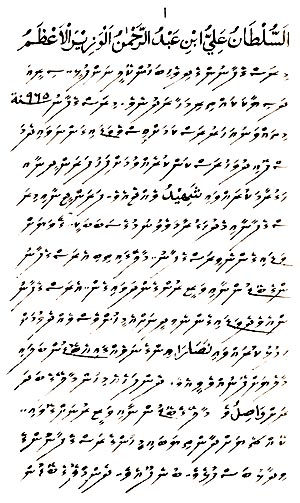
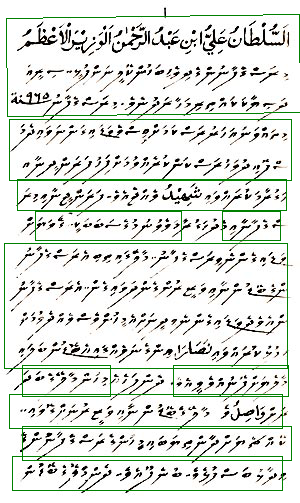

# GoogleCloudVisionOCR
Sample on how to get OCR done (works for thaana script) using Python 3 + Google Cloud Vision API's

First setup the environment,  instructions at : https://cloud.google.com/vision/docs/quickstart

example usage:
  python3 thaanaocr.py img1.png -out_image out.png -out_file out.txt

-out_image (optional)
-out_file (optional)

👇

Output: out.txt

 ޖުމްހޫރީ ޕާޓީ ( ޖޭޕީ ) އޮތީ މި އަހަރުގެ ރިޔާސީ އިންތިޚާބު ކާމިޔާބުކޮށް ، ވެރިކަމަށް އައުމަށް ތައްޔާރުވެފައި ކަމަށް އެ ޕާޓީގެ ޑެޕިއުޓީ ލީޑަރު ކަމަށް ދެވަނަ ފަހަރަށް ހޮވި ޑރ . ހުސެއިން ރަޝީދު ހަސަން މިއަދު ވިދާޅުވެއްޖެ އެވެ .

 انطان علی ابن عبد الى الونی الاغظ މިރުސްމާފާނުން ދިވެ ( ބަންކޮލީ ނަންފުޅި - - ޔތު ދަޒިޔާކައްތިމަނަދުނެވެ . ރަސްގެފާނު % ޑޫ
 
 Sonntasnobrzanjine , Campinjribiscrepanja
 
 ކަމުދާ ކަނަވަޝުهللا ލެއްޖެއެވެ . ފަނަންޖަނާބިމިނު
 
 intense
 
 futbém 175
 
 ވަޑައިގެންނެވި ރަސްގެފާނު . މާތާޅިއިތިބި އެރަސްގެފާނު ނާގެ ބޮޑުންނާޠިވަޒީނުންގެންދަވައިގެން . އެރަސްގެފާނު ންހެވެދެވިޑައިގެންނެވިދިނަންއެއީ ފުނާވެސް ވެއްދެމިވަ " / މުލިކާނައްވައިޣަاއިންވެ ނަވެއް ، އި ( ( ޓެޑުން ބަލައި
 
 m ašnijimas

Bongoziro

ނަށަވަلهل ލާރި ، ބޮޑުންނާއި ވަޒީރުނަދޫ ލައި . .
 97 % semifinórejypso
 ވިދާޅު ބަސްފުޅެ . ބުނެ ފޫޔެވެ . ދެންމި ބޮން

